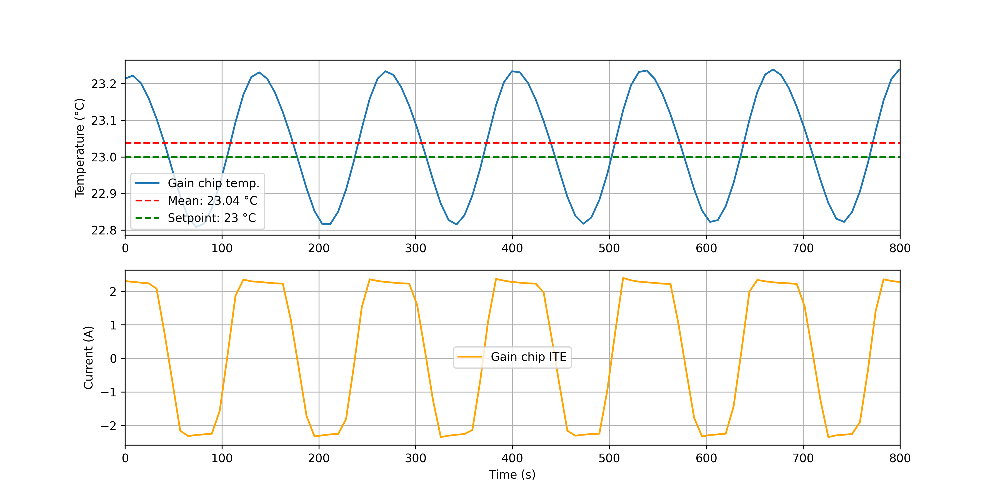
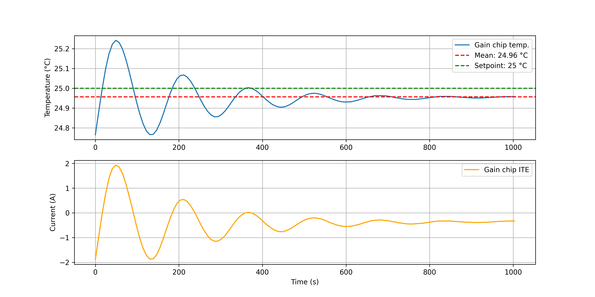
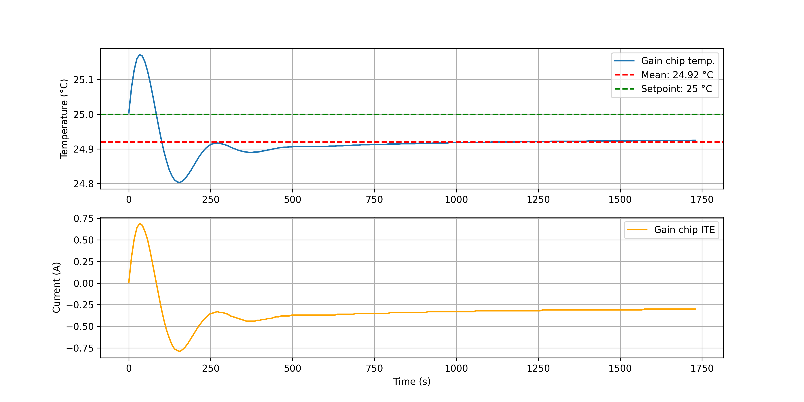
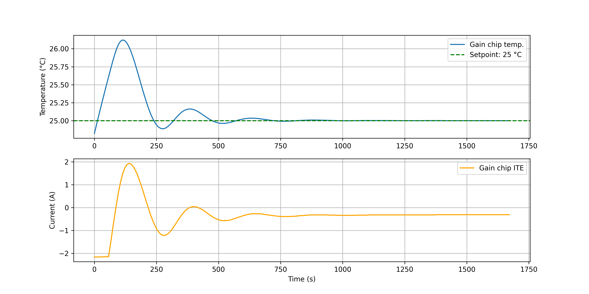
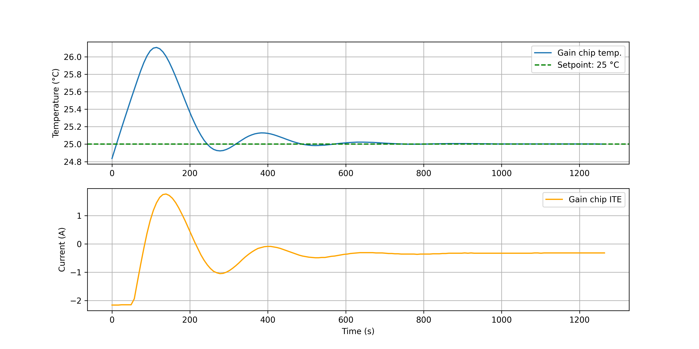

## PID tuning of the Arroyo
In this document, I will discuss the process of PID tuning of the Arroyo and problems I encountered.

### Gain
Before being able to tune the PID values, each channel's gain must be set to PID.\
As standard they are set to 10, this setting prevents the PID values from being read or written.

```IEEE-488.2
TEC:GAIN PID
```
### Auto-tuning
The Arroyo supports an auto-tuning function, which runs an algorithm to find fitting PID values for the selected channel.\
The algorythm used by the Arroyo is a Ziegler-Nichols method, which is a well known method for PID tuning.

This method works by ramping the P-value until the system starts to oscillate.\
The P-value at which the system starts to oscillate is called the ultimate gain (Ku) and used to estimate the PID values.

I only encountered problems with the auto-tuning function, as when ever I tried to run it, the controller would max out the TEC's and not recover.\
It would plummet the temperature, but I never saw it try to recover.


*This was performed at 25°C setpoint => $\Delta T = -7°C$ equals to $T = 18°C$*

On the day of performing this test, the lab temperature was 24°C, whilst there were problems with the dehumidifier, which caused the relative humidity to reach above 50%.\
For this reason, I never wanted to reach temperatures below 15°C, as the risk of condensation was too high.

After this occurring for every try, I started to tune manually, which is a much slower process, but I can control it.

### Manual tuning
Since the auto-tuning function was not working, I had to tune the PID values manually.\
For that I tried to follow the Ziegler-Nichols method but quickly realized it would take way too long because of the long period times of the oscillations.\
That is why I decided to roughly guess the P-value at which I saw the stable oscillation.\
Here I will discuss the steps I took on the example of "*CH 2 Case near Gain chip*".

#### Finding the P-value
For finding the right P-value, I started with a high P-value of 20.\



Here I saw a constant oscillation of the temperature but the current would constantly hit a maximum of 2.2 - 2.4A.\
This is caused, by the fact that the TEC's are connected in series, which means that they have a resistance high enough to run into voltage limits.

I found a datasheet of the TEC's, which states that the internal resistance is about 2.5 $\Omega$.
In series that means that for a 12 V supply, the maximum current would be 2.4 A, which is exactly what I was seeing.

Then I lowered the P-value to 8 at which point I started to see a decreasing oscillation amplitude, but the current was still hitting its limits.\



Furthermore, the oscillation period was about 200 seconds, which is already a good improvement from the higher P-value.\
Longer periods are preferred, as that would allow for easier correction using the piezo of the outcoupler.



Finally, I lowered the P-value to 4, which resulted in a quickly decaying oscillation, without constantly hitting the current limits.

#### Finding the I-value
After finding a suitable P-value, there is still a constant offset from the setpoint, as can be seen in the figure above.\
This can be corrected for by adding an I-value.\
Here I had to be careful and choose a very low value, since for anything above 0.01, any setpoint change would result in a constant oscillation.



Using a value of 0.003, I was able to correct the offset without introducing oscillations.

#### Finding the D-value
Finally, for reducing the impact of the I-values tendency to overshoot, I added a D-value of 100.
This is a result of a lot of trial and error since below 100 there was no noticeable effect, but going above this value wouldn't improve the overshoot either.



Here we can see how the D-value reduces the overshoot and also draws out the period of the oscillation.\
This is the final result of the PID tuning, which I was able to achieve for all channels.\
There were some differences in the values, but the method was the same for all channels.