# Final measurements
In this document, we will discuss the final collection of measurements taken for my project.\
I will mostly discuss wavemeter measurements in this document, as they are the most relevant.

## Pre modification
Before the modification, I did a lot of measurements because I was unsure which behaviour was the most important to measure.\
I also had a lot of problems with temperature stability, which caused the VECSEL to constantly jump modes.\
There was no obvious way to take measurements that wouldn't include a lot of these jumps, so I had to pick out regions in which the VECSEL would stay in one mode.\
This is because I only care about stability of a single mode, since later I was hoping to achieve single mode operation.

All measurements were taken at 23 A pump current.

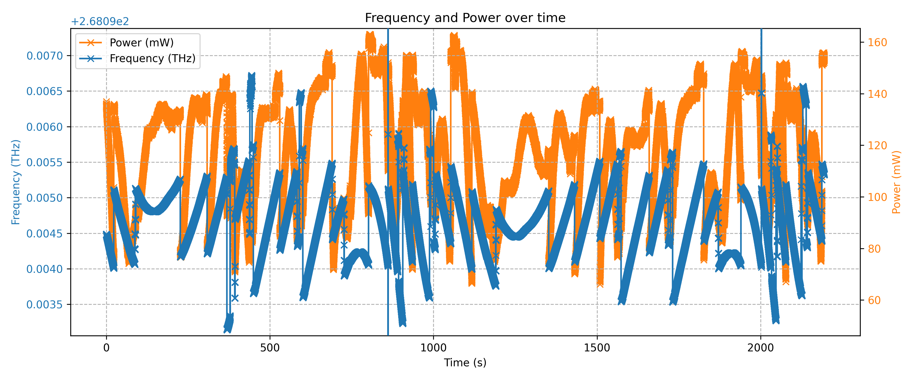

As can be seen in this figure, the VECSEL output is very unstable, and jumps between modes frequently.\
I theorized, that this was mostly due to temperature changes at the Gain chip (GC), and changes in cavity length.

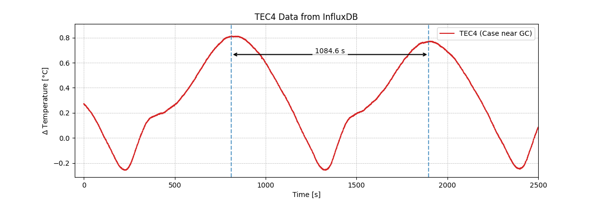

In this figure, we can see the temperature of the case near the GC over time.\
The temperature is very unstable and oscillates with a period time of about 1080 seconds.\
If you look in the time series figure, you can see that there are some minima (at about 200 and 1300 s) with a similar period time.\
This is a strong indication, that these mode jumps are caused by temperature changes at the GC.

### Segmentation
To be able to analyze the data taken, I had to segment the data into regions where the VECSEL was in a single mode.\
I selected modes, by looking at the frequency difference and taking a region, in which it stayed in one mode for the longest.\
This method might not differentiate between regions where the shows unrepresentative behaviour, i.e. where the temperature is in a maximum or minimum, this will be discussed later.

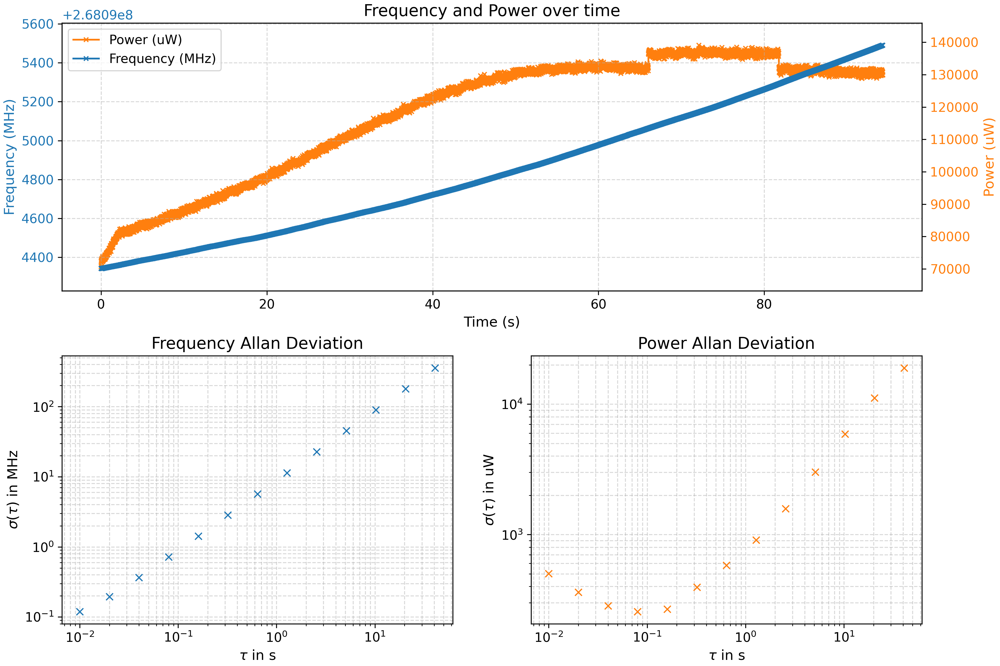

Here we can see the longest single mode segment of one of the measurements.\
The segment is about 90 seconds long, and we can see a clear drift in frequency.

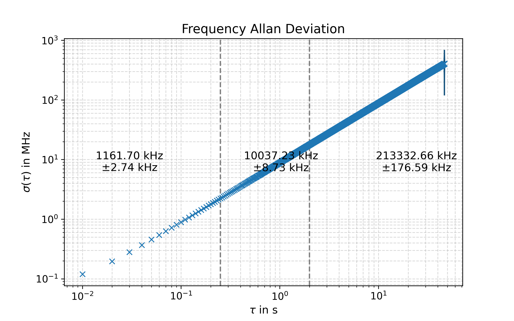

In this allan deviation plot, we can see that the frequency stability for short time scales (>250 ms) averages to about 1,2 MHz.\
This is within one mode, which shows that the VECSEL is capable of reaching the desired stability.\
Since the Target is to get below 1 MHz, there is still some work to be done.

After some wating I got another measurement, wich was more stable than this one, but we will see that it isn't as respresentative as the previous one.

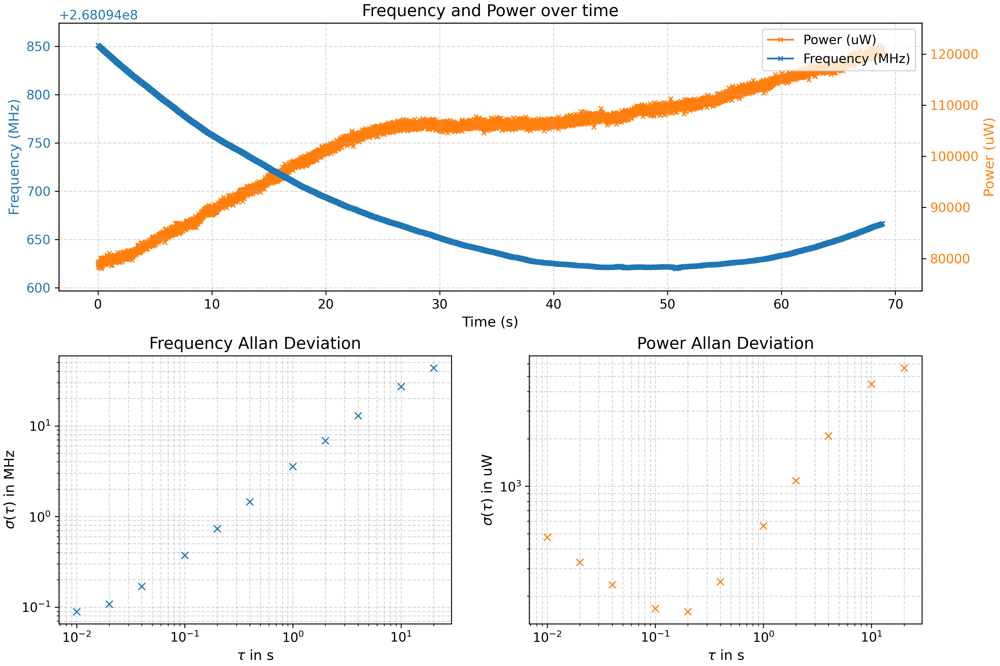

Here we can see a measurement of one of the frequency minima seen in the unsegmented time series.\
The segment is about 70 seconds long, and we can see a clear drift in frequency.\
Since here we are in a temperature extremum and the temperature is changing very slowly, the frequency drift is also very slow.

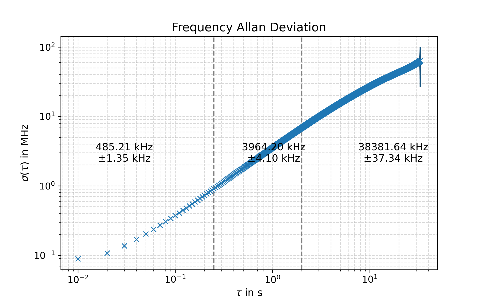

Here we can see that the frequency stability for short timescales averages to about 485 kHz.\
This is a very different result to the previous measurement, but shows that I have to be very careful when talking about the stability.\
Without thinking about the measurement conditions and how the measurement represents the actual behaviour of the VECSEL, it could be very misleading.

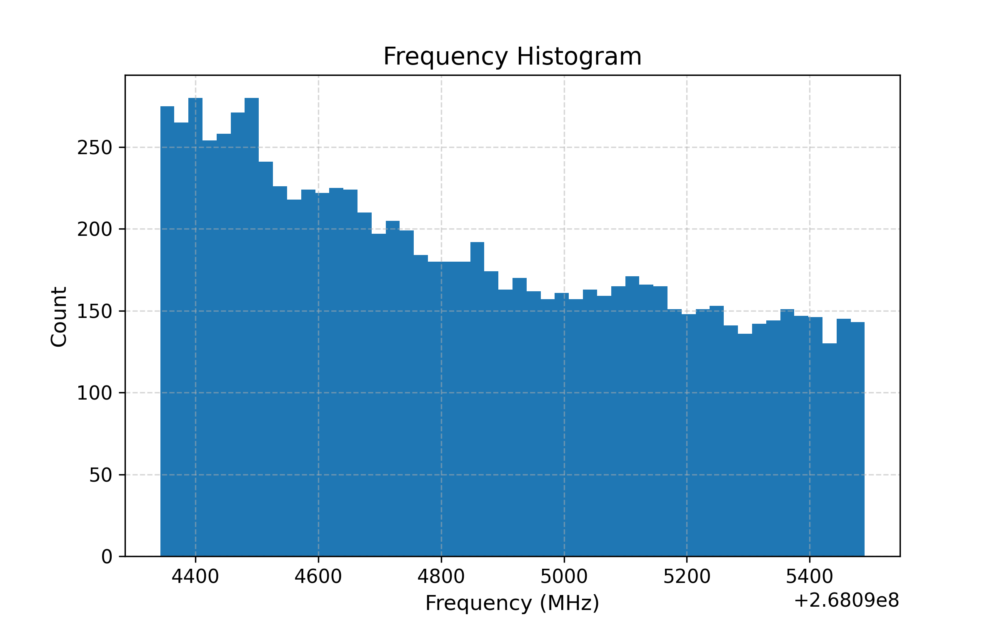
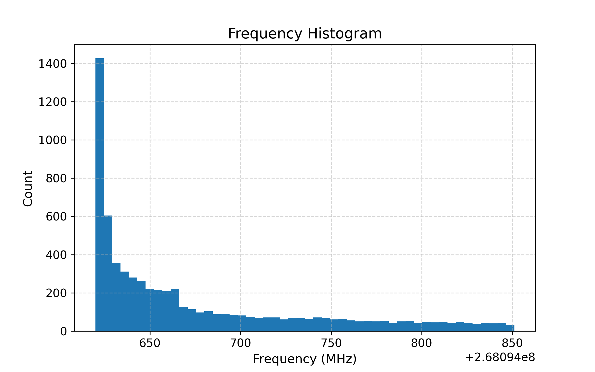

Viewing the histograms of the two measurements, we can easily see that the second measurement should be considered a lower bound for the frequency stability.\
Luckily, after getting the temperatures under control, I can more easily compare measurements.

## Coldplate modification
After mounting the VECSEL on the coldplate, I was able to get much more stable measurements.

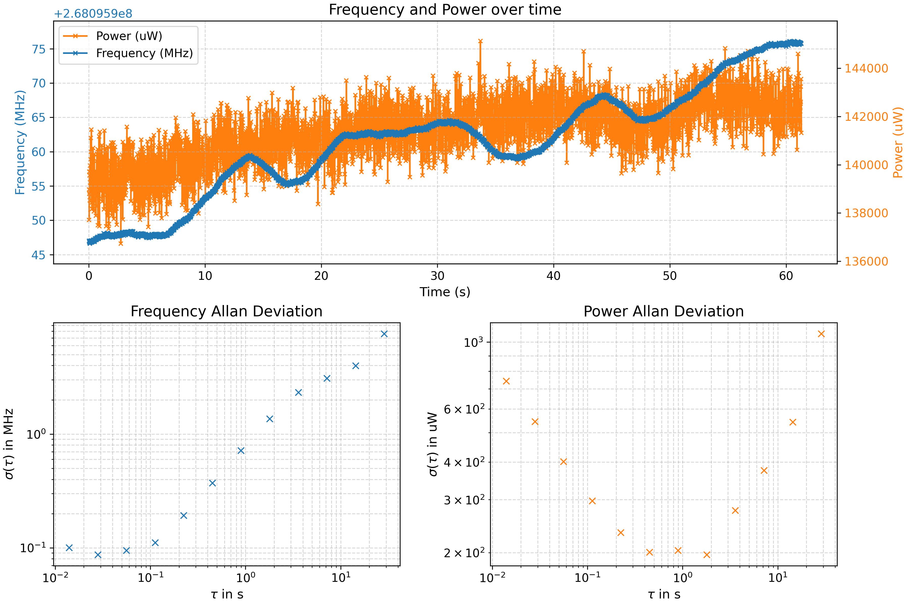

Here we can see that the frequency is now much more stable, and there are no mode jumps.\
The frequency is still drifting, but before there were drifts of several hundred MHz, now the drifts are on the order of 30 MHz.\
There was no need for segmentation, since the VECSEL stayed in one mode for the whole measurement.

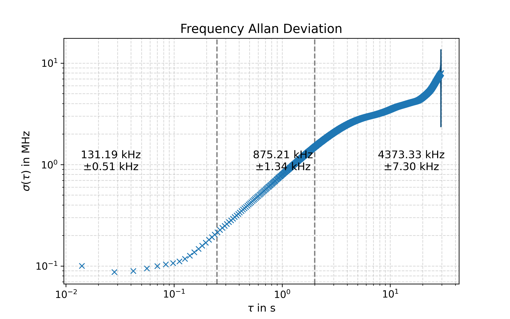

In this allan deviation plot, we can see that the frequency stability for short time scales averages to about 131 kHz.\
This is a 4 - 10 times improvement over the previous measurements, and shows that the coldplate modification was very successful.\
The frequency stability is now well below 1 MHz, which was the target for this project.

Furthermore, I noticed that when making noise near the VECSEL, the frequency would jump considerably, so the next modification could bring more improvements.

## Sound isolation modification
After the sound isolation modification, I was able to get even more stable measurements.\
It seems the sound isolation works as thermal isolation aswell, since the frequency falls steeply when the lid is removed.

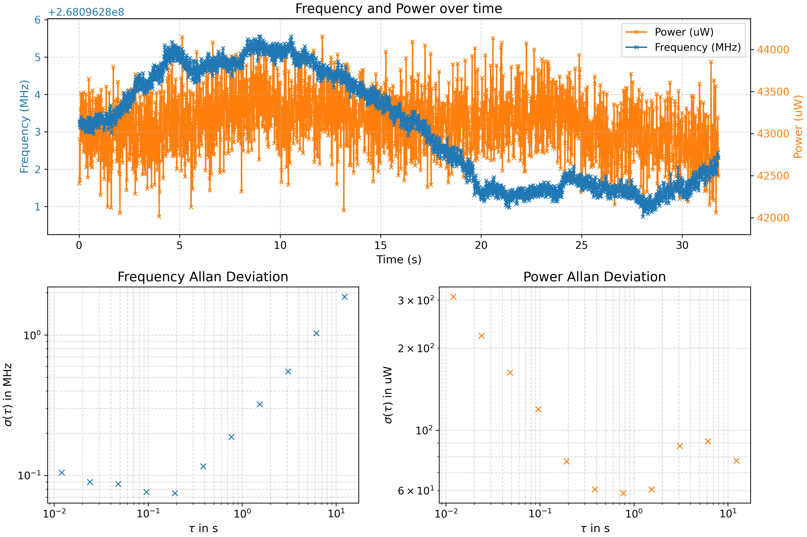

Here we can see that the frequency is now even more stable, since we are now only drifting about 5 - 6 MHz over the whole measurement.\
We can also see that the power is much more noisy and also lower, which I have no explanation for, but it doesn't seem to affect the frequency stability.

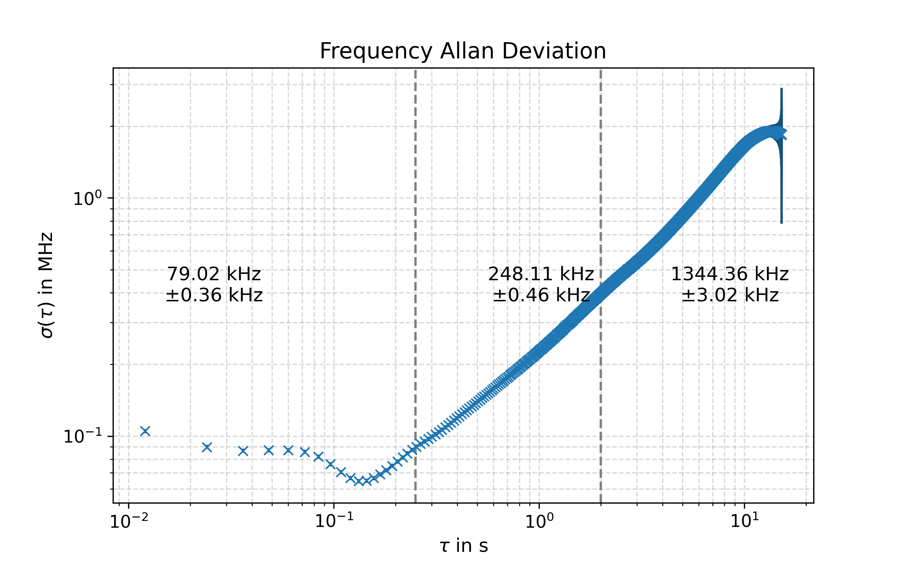

Finally, in this allan deviation plot, we can see that the frequency stability for short time scales averages to about 79 kHz.\
We can also see, that the best stability is reached at just above 100 ms averaging time, for shorter timescales, there seems to be a noise platou.\
I theorize that this is due to the wavemeter, But further investigation is needed to confirm this.

Overall, the sound isolation modification was very successful, and I was able to reach a frequency stability of 79 kHz, which is well below the target of 1 MHz.

*Next problem would be, that the VECSEL doesn't lase at the moment and I couldn't get it to do so after several hours of trying.*

For the moment, I will try to compare my results to Tobi's and try to find any similarities or differences.