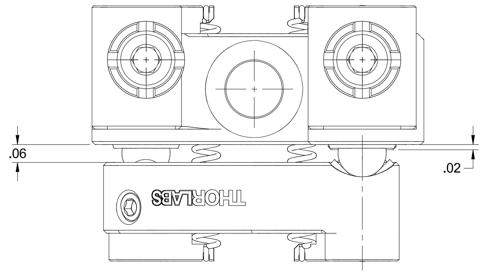

# VECSEL adjusting
This document provides a short guide on how I adjusted the VECSEL neXt to get it to lase.
These steps were performed when I first tried to get the VECSEL to lase (May 2026), but did not work, when I tried again after it stoped working (July 2026).

## Rough alignment
After I couldn't get the VECSEL to lase with frequency selective components (FSC) installed, I removed those and tried to get a rough alignment of the cavity.\
For rough alignment, I looked top down onto the outcoupling mirror and adjusted the screws until the contact points to the mount were at the same distance.

Here you can see which distances I tried to make equal. I did this, because I expect the mount to be very accurately placed in the case, since it is held with dowel pins.\
Aligning the mirror to be in line with the foreseen beam path is not enough, because the BRF (which is not present) would create a beam offset.\
This offset would be (from the point of view of the mirror) towards the left. But since the BRF is not present and therefore there is no beam offset, the reflected beam will be offset to the right.

For that reason, after rough adjusting, the mirror is to be adjusted to the left, so that we can hit the gain chip (GC).\
This method will give us the rough alignment of the vertical axis (responsable for left and right movement) of the mirror.

To adjust the horizontal axis (responsable for up and down movement) of the mirror, I first loosened the screw as far as possible.\
Then in combination of tilting the horizontal axis by moving the mirror with my finger, and simultaneously adjusting the vertical axis, I scanned the mirror position.\
My procedure was as follows: Step the v-axis by a small amount (to the left), then slowly tilt the mirror down and up with my finger.

This way, I could find a position where the cavity was closed and the VECSEL started to lase.\
But since I didn't have any luck this time around I tried a different approach, where I couple in a laser pointer.

## Coupling in a laser pointer
I used the existing fiber to couple in a laser pointer. The laser pointer used, was a standard red laser pointer, found in 'fiber-accessories'.\
With this coupled in, I could see a spot on the corner of the GC. It only barely hit the GC which is why there was almost no reflection.\
But after trying the methode described above, I could see a small reflection on the GC. After overlapping the reflection with the incoming beam, I once again tried to close the cavity with the pump laser turned on.\
This didn't work either.

*Sorry Sriram this is your problem now* :)